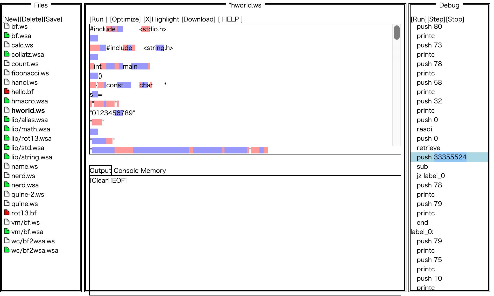

# 問題6 
## 参考サイト
- [問題](https://ksnctf.sweetduet.info/problem/7)
- [解説](https://qiita.com/samohan/items/766deca6f39c37122c0e)
- [ideone.com](https://ideone.com/) : オンラインコンパイラ
- [Whitespace](https://ja.wikipedia.org/wiki/Whitespace)
- [whitelips IDE for whitespace](https://vii5ard.github.io/whitespace/) : Whitespaceのためのデバッガー

## 解法
### 1. ファイルの実行
この[コード](../codes/p7_program.cpp)を[ideone.com](https://ideone.com/)のWhitespace用のコンパイラを用いて実行  
**実行結果**  
  
`Runtime error #stdin #stdout #stderr 0.01s 5356KB comments (0)`だったので、デバッグする必要がある  
### 2. デバッグ
[whitelips IDE for whitespace](https://vii5ard.github.io/whitespace/)を使ってこの[コード](../codes/p7_program.cpp)をデバッグをする  
アセンブラに変換後なぜかこの数値に着目  
  
`33355524`を入力として、再度実行  
   

## メモ
アセンブラ読めるようになりたい
