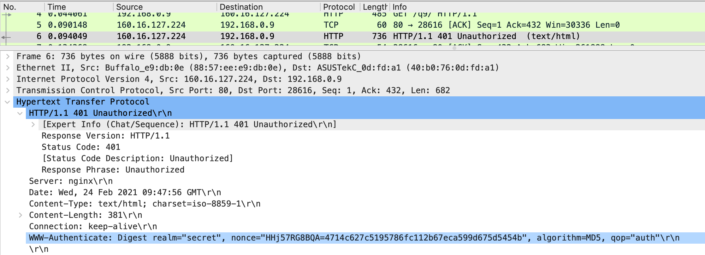
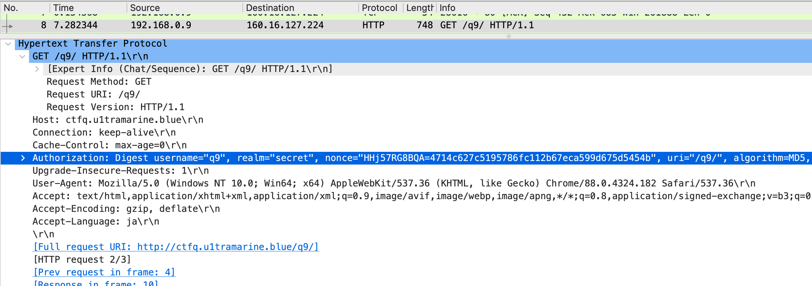

# 問題9
## 参考サイト
- [問題](https://ksnctf.sweetduet.info/problem/9)
## 解法
### 1. ファイルを開く
### 2. HTTPの戻り値を見る

→ [WWW-Authenticate](https://developer.mozilla.org/ja/docs/Web/HTTP/Headers/WWW-Authenticate): Digestから、Digest認証であることがわかる
### 3. 成功しているHTTP/GETを見る

以下のことが読み取れる
```
Digest username="q9", 
realm="secret", nonce="HHj57RG8BQA=4714c627c5195786fc112b67eca599d675d5454b", 
uri="/q9/", 
algorithm=MD5, 
response="26c8019eb6f7f41b9c14b4cbda48ab2e", 
qop=auth, 
nc=00000002, 
cnonce="656335d78cef6e86"
```
[digest認証](http://x68000.q-e-d.net/~68user/net/http-auth-2.html)より、
response の生成方法は以下のとおりです
```
request-digest  = <"> < KD ( H(A1),     unq(nonce-value)
                                     ":" nc-value
                                     ":" unq(cnonce-value)
                                     ":" unq(qop-value)
                                     ":" H(A2)
                             ) <">
 A1       = unq(username-value) ":" unq(realm-value) ":" passwd
 A2       = Method ":" digest-uri-value
```
```
response の値
「A1のMD5値 + ":" + nonce値 + ":" + nc値 + ":" cnonce値 + ":" + qop値 + ":" + A2のMD5値」の MD5 値  
この A1 とは  
「username + ":" + realm + ":" + passwd」の MD5 値  
A2 は  
「Method + ":" + uri値」(Method は HTTP の GET や POST のこと)  
いずれの値も両端をダブルクォートで囲みません。  
```
ここで、
```
responce = A1(MD5ver.):HHj57RG8BQA=4714c627c5195786fc112b67eca599d675d5454b:656335d78cef6e86:auth:A2(MD5ver)
A1 = username:secret:password
A2 = GET:/q9/
```
```
A1 = ユーザ名 ":" realm ":" パスワード
A2 = HTTPのメソッド ":" コンテンツのURI
response = MD5( MD5(A1) ":" nonce ":" nc ":" cnonce ":" qop ":" MD5(A2) )
```
[MD5逆変換サイト](https://hashtoolkit.com/decrypt-md5-hash/)を用いて、
```
response="26c8019eb6f7f41b9c14b4cbda48ab2e"
```
を変換すると、
```
c627e19450db746b739f41b64097d449:HHj57RG8BQA=4714c627c5195786fc112b67eca599d675d5454b:00000002:656335d78cef6e86:auth:adea3748da59405c1f4c1650442607a1
```
となる。このことから、
[p9_digest](../codes/p9_digest.py)を用いて、ログインすると
[結果](../codes/p9_result.html)このようになった。
## メモ
### Digest認証 
ユーザ名とパスワードをMD5でハッシュ（ダイジェスト）化して送るHTTPの認証方法。 [ref](https://medium-company.com/digest%E8%AA%8D%E8%A8%BC/#Digest)
